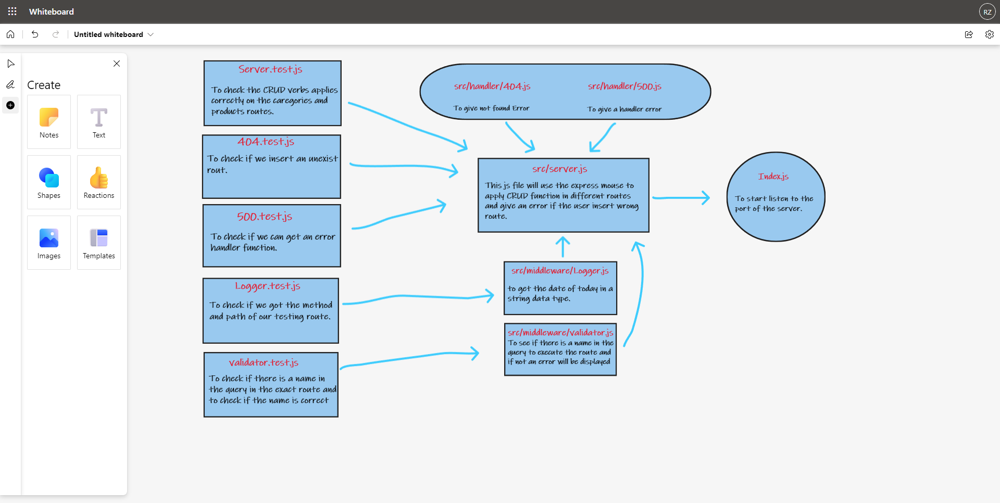

# basic-express-server

## Author: Rami Zregat

## Project: Express

## Lab 2

**Description of today lab:**  
 Today we will Build our core, standards compliant Express server.

## Links to check:  
Heroku application for main branch: https://rami-basic-express-server.herokuapp.com/

Github actions link: https://github.com/RamiZregat/basic-express-server/actions

Github pull request link: https://github.com/RamiZregat/basic-express-server/pull/4

## Dependencies:
- dotenv
- express
- jest
- supertest

## How to start the server:  
- npm start

## What should I run on the terminal or postman?
- npm run start /on the terminal
- GET - http://localhost:3030/
- GET - http://localhost:3030/person
- GET - http://localhost:3030/person?name=your-name

## UML

